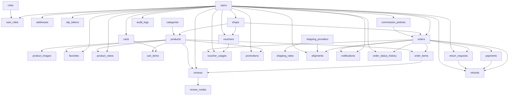

# DB-01 Schema and migration ordering

Source: Master Plan E2/E3/E4. All 30 planned tables are represented below; none is created by the DB-01 baseline. HP = Hoàng Phúc, TD = Tiến Đạt, QD = Quốc Đạt.

## Foreign-key prerequisites

| Table | Owner | Referenced tables (including nullable FKs) |
| --- | --- | --- |
| users | HP |  |
| roles | HP |  |
| user_roles | HP | users, roles |
| addresses | HP | users |
| otp_tokens | HP | users |
| shops | HP | users |
| categories | QD |  |
| products | HP | shops, categories |
| product_images | HP | products |
| favorites | QD | users, products |
| product_views | QD | users, products |
| carts | TD | users |
| cart_items | TD | carts, products |
| orders | TD | users, shops, commission_policies |
| order_items | TD | orders, products |
| payments | TD | orders |
| vouchers | TD | shops, users |
| voucher_usages | TD | vouchers, users, orders |
| promotions | TD | products, users |
| reviews | QD | order_items, users, products |
| review_media | QD | reviews |
| shipping_providers | QD |  |
| shipping_rates | QD | shipping_providers |
| shipments | QD | orders, shipping_providers, users |
| notifications | QD | users, orders |
| order_status_history | TD | orders, users |
| return_requests | TD | orders, users |
| refunds | TD | orders, payments, return_requests, users |
| commission_policies | QD | users |
| audit_logs | QD | users |

Machine-readable source: `database-dependencies.json`. Multiple FK columns pointing to users are collapsed into one graph edge. The graph ignores logical audit target references and reverse 1:N navigation properties; those are not additional FKs.

## One valid creation order

1. users
2. roles
3. categories
4. shipping_providers
5. user_roles
6. addresses
7. otp_tokens
8. shops
9. carts
10. shipping_rates
11. commission_policies
12. audit_logs
13. products
14. orders
15. vouchers
16. product_images
17. favorites
18. product_views
19. cart_items
20. order_items
21. payments
22. voucher_usages
23. promotions
24. shipments
25. notifications
26. order_status_history
27. return_requests
28. reviews
29. refunds
30. review_media

This topological order covers 30 unique tables with no FK cycle. Nullable FKs still require the referenced table to exist. It is a prerequisite order, not permission to code every table now.

Orders depends on commission_policies, whose UI is scheduled later. QD and TD must schedule the policy table migration before the Order migration, or separately agree on a phased FK addition. DB-01 does not silently remove the FK or implement ADMIN-06. Products similarly requires categories, so HP and QD must coordinate before PROD-00. Reviews follows order_items; refunds follows payments and return_requests.

## ERD dependency diagram

Arrows run from the referenced parent table to the dependent child table; cardinality and nullable details follow E2 below.

## E2 field and relationship inventory

The following is transcribed from the supplied plan. Detailed lengths, nullability and enum values remain contracts for the owning module; DB-01 does not guess them.

- 1 User /   users email, username, password_hash, full_name, phone, avatar_key, status, token_version, version 1:N UserRole, Address, Order; 1:0..1 Shop/Cart HP
- 2 Role /   roles code unique, description 1:N UserRole HP
- 3 UserRole /   user_roles PK ghép   (user_id, role_id) FK user_id → users; role_id → roles HP
- 4 Address /   addresses receiver_name, phone, province_code, district, detail, is_default FK user_id → users, N:1 User HP
- 5 OtpToken /   otp_tokens purpose, code_hash, expires_at, consumed_at, attempts, sent_at FK user_id → users, N:1 User HP
- 6 Shop /   shops name, slug unique, logo_key, banner_key, description, pickup_address, status, rejection_reason, version FK owner_id → users unique; N:1 owner về mặt FK, 1:0..1 về cardinality HP
- 7 Category /   categories name, slug unique, active 1:N Product; danh mục một cấp QD
- 8 Product /   products name, description, price, stock, status, version FK shop_id → shops; category_id → categories HP
- 9 ProductImage /   product_images storage_key, position, alt_text FK product_id → products, N:1 HP
- 10 Favorite /   favorites created_at FK user_id, product_id; unique pair QD
- 11 ProductView /   product_views last_viewed_at FK user_id, product_id; unique pair QD
- 12 Cart /   carts version FK user_id → users unique TD
- 13 CartItem /   cart_items quantity, selected FK cart_id, product_id; unique pair TD
- 14 Order /   orders order_code unique, checkout_key, request_hash, status, receiver/address snapshot, subtotal, discount_total, shipping_fee, grand_total, commission_rate_snapshot, commission_amount, ready_at, delivered_at, cancelled_at, cancellation_reason, inventory_released_at, version FK buyer_id → users; shop_id → shops; commission_policy_id → policies nullable TD
- 15 OrderItem /   order_items product_name_snapshot, unit_price, discount_snapshot, final_unit_price, quantity, line_total FK order_id → orders; product_id → products TD
- 16 Payment /   payments method, status, amount, provider_reference unique nullable, attempt_key unique, paid_at, expired_at FK order_id → orders; 1 order:N payment attempts TD
- 17 Voucher /   vouchers code unique, scope, type, value, max_discount, min_subtotal, starts_at, ends_at, total_limit, per_user_limit, active, version FK shop_id nullable; created_by → users TD
- 18 VoucherUsage /   voucher_usages status, discount_amount, version FK voucher_id, user_id, order_id; unique order_id TD
- 19 Promotion /   promotions name, discount_percent, starts_at, ends_at, active FK product_id, created_by; mỗi promotion cho 1 sản phẩm TD
- 20 Review /   reviews rating, comment, visibility, created_at FK order_item_id unique; user_id, product_id QD
- 21 ReviewMedia /   review_media media_type, storage_key, position FK review_id → reviews QD
- 22 ShippingProvider /   shipping_providers code unique, name, active 1:N ShippingRate/Shipment QD
- 23 ShippingRate /   shipping_rates service_code, destination_region, fee, active, version FK provider_id; unique provider/service/region QD
- 24 Shipment /   shipments status, shipping_service_snapshot, fee_snapshot, attempt_count, max_attempts, failure_reason, picked_up_at, delivered_at, version FK order_id unique; provider_id; assigned_shipper_id → users nullable QD
- 25 Notification /   notifications type, title, message, read_at, dedup_key unique, created_at FK recipient_id → users; order_id nullable QD
- 26 OrderStatusHistory /   order_status_history from_status, to_status, reason, created_at FK order_id; actor_id nullable cho system action TD
- 27 ReturnRequest /   return_requests reason, status, requested_at, decision_at, received_at, decision_note, restockable FK order_id unique; requested_by; decided_by nullable TD
- 28 Refund /   refunds amount, status, reason, proof_reference, requested_at, completed_at, version FK order_id unique; payment_id; return_request_id nullable; processed_by nullable TD
- 29 CommissionPolicy /   commission_policies rate_percent, effective_from, active, created_at FK created_by → users; policy toàn hệ thống QD
- 30 AuditLog /   audit_logs action, target_type, target_id, before_summary, after_summary, reason, created_at FK actor_id → users nullable; target là tham chiếu logic QD
